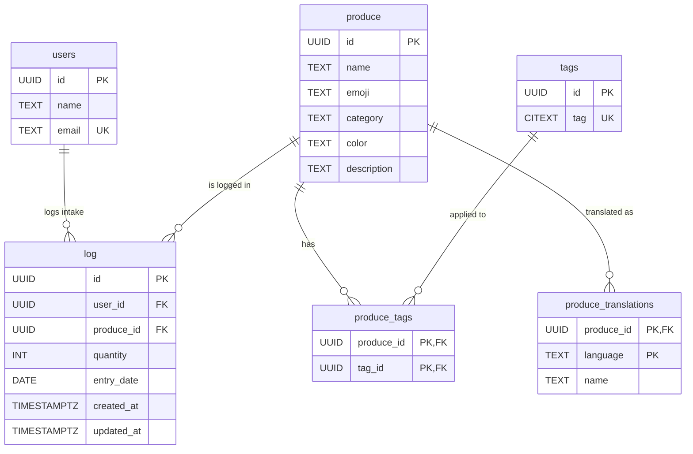

# greenOmeter

A Spring Boot application for tracking daily intake of fruits, vegetables, and other produce. Log what you eat, earn achievements, and build healthy habits.

## Features

- Track daily produce intake per user
- Categorized produce catalog (fruits, vegetables, berries, nuts, mushrooms, herbs, legumes, seeds)
- Tagging system for produce
- Multi-language support with produce translations
- Admin UI for managing the produce catalog

## Prerequisites

- JDK 17+
- Docker (for PostgreSQL)

## Running the project

1. **Start the database:**

   ```bash
   docker compose up -d
   ```

   This starts PostgreSQL on port `50068` with database `greenometer`.

2. **Run the application:**

   ```bash
   ./gradlew bootRun
   ```

   The app starts at [http://localhost:8080](http://localhost:8080). Flyway migrations run automatically on startup.

3. **Access the admin UI:**

   Go to [http://localhost:8080/admin/produce](http://localhost:8080/admin/produce) to manage the produce catalog.

## Running tests

```bash
./gradlew test
```

Tests use an in-memory H2 database, so no running PostgreSQL is needed.

## Database Schema


